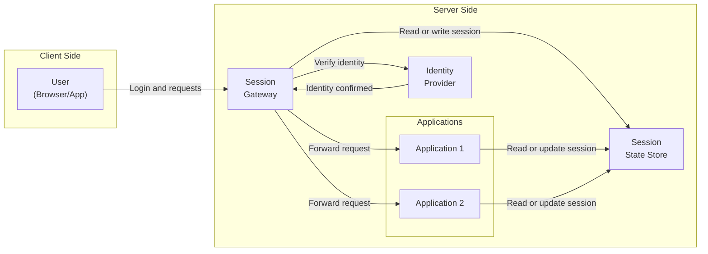
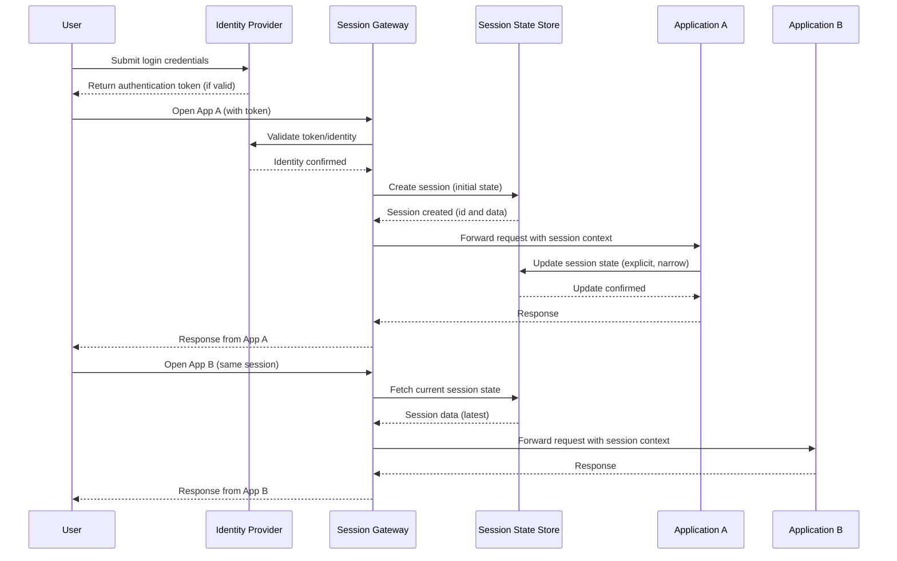

# Single State Model Architecture

## Problem statement: what modern architectures get wrong

A lot of modern systems confuse motion with progress.

They break simple products into many moving parts, then spend the rest of their lives managing the consequences: network calls everywhere, partial failures, inconsistent user experience, and endless effort spent on tracing, retries, and compensating actions. The architecture becomes a theatre of distributed complexity where the real work is keeping the system standing up, not delivering value.

Common failure patterns:

- State is scattered across services and browsers, so nobody can say what the user session actually is right now.
- Identity, auth, entitlements, and feature access are reimplemented in each application, and drift over time.
- Systems rely on eventual consistency for things that users expect to be consistent immediately.
- Engineers optimise for theoretical scalability and purity, and pay with operability, predictability, and human stress.

The result is systems that feel jumpy, brittle, and argumentative. They can be made to work, but they are rarely calm.

## Definition of the Single State Model

The Single State Model is a deliberately simple approach to cross-application session behaviour.

A centralised session state store is the single source of truth for user and session-level state that needs to be consistent across applications. All applications read from it and, in tightly controlled ways, write to it.

The state is intentionally narrow:

- Identity and authentication status
- Entitlements and authorisation decisions (or inputs to them)
- Cross-application coordination signals (small, explicit, time-limited)

Domain data stays inside each application. The central store is not a database of record. It is a session truth, not a business truth.

Consistency is strong inside a session boundary, and controlled across sessions.

## Design principles and non-goals

### Design principles

- **One place to look** for session truth. If something about the current session matters across apps, it lives in one store.
- **Small state on purpose.** The store holds only what must be shared. Everything else stays local.
- **Session coherence beats global coherence.** Users experience a session, not a cluster. Optimise consistency where humans feel it.
- **Explicit writes.** Applications do not casually mutate shared state. Writes are limited, audited, and easy to reason about.
- **Calm degradation.** When the store is unavailable, apps behave predictably and safely, with clear fallbacks.
- **Simple over clever.** Prefer a simple contract over an elaborate platform.

### Non-goals

- Not a replacement for application databases.
- Not a distributed transaction system.
- Not a global event-sourcing backbone.
- Not a way to unify all domain models.
- Not a mandate for microservices, nor a crusade against them. It is about reducing shared-session chaos.

## Minimal logical architecture

### Components

1. **Session State Store**
   
   - Holds session records keyed by session id.
   - Stores a small, versioned session document.
   - Enforces TTL and size limits.
   - Supports read, conditional write, and revoke.

2. **Session Gateway (thin)**
   
   - The only write path into the store.
   - Validates schemas and limits what can change.
   - Applies access control and auditing.
   - Issues session tokens or validates them.

3. **Applications (many)**
   
   - Treat the session store as read-mostly.
   - Use session state to make consistent decisions: who is this, what can they do, what context applies.
   - Keep domain data and workflows local.
   - May publish small coordination signals through the gateway when genuinely needed.

4. **Identity Provider (external or internal)**
   
   - Authenticates the user.
   - Provides claims or attributes used to build the session state.
   - The session store holds the session truth derived from identity, not the identity system itself.

### Diagram: overall component architecture

### Diagram: session lifecycle across applications

## Consistency contract in plain English

- Within a single session, all applications see the same session state.
- When an application reads session state and then acts on it, it can rely on that state not changing unexpectedly without a deliberate update.
- Updates to session state are atomic. An update either happens fully or not at all.
- If two updates race, only one wins, and the loser must re-read and try again if it still needs to change something.
- Across sessions, changes are controlled. A new session may start from fresh truth, or from a clearly defined carry-over subset, but nothing leaks accidentally.

## Failure modes and graceful degradation behaviour

Design the model assuming the store will be slow or unavailable sometimes. The goal is safe, predictable behaviour.

### Failure mode: session store unavailable

- Applications that require session truth for safety (auth, entitlements) fail closed.
  - Example behaviour: ask the user to sign in again, or return a clear "temporarily unavailable" response.
- Applications may use a short-lived cached snapshot if it is safe and explicitly allowed.
  - Cache is time-bounded and treated as potentially stale.
- Cross-application coordination features degrade first.
  - Example behaviour: shared banners, shared context, or navigation hints disappear before core access breaks.

### Failure mode: partial network partitions

- Reads may succeed while writes fail.
- Applications should prefer read-only behaviour when uncertain.
- Writes to session state should be rare enough that "try again after refresh" is acceptable.

### Failure mode: corrupted or invalid session document

- Gateway rejects invalid writes.
- Applications treat invalid session as unauthenticated and request re-authentication.
- Prefer re-creating session state from identity rather than patching unknown state.

### Failure mode: store latency spikes

- Timeouts are explicit and short.
- User-facing behaviour is consistent: either you have session truth quickly or you fall back to a known safe path.
- Avoid UI that hangs without feedback.

## Security and access control considerations

- **Least privilege by application.** Each application gets only the ability to read the parts of session state it truly needs.
- **Write permissions are exceptional.** Most applications should never write. If they do, they write only a narrow, pre-agreed subset.
- **Gateway enforces schema and policy.** No direct writes from applications to the store.
- **Session tokens bind identity to session id.** Tokens are signed, short-lived, and rotated.
- **Entitlements are treated as security-critical.** If uncertain, deny.
- **Auditing is built in.** Every write is attributable: who, what, when, and why (with a small reason code).
- **Avoid sensitive personal data in session state.** Keep it to identifiers and decisions, not underlying private attributes.
- **Revocation is first-class.** You can kill a session immediately and all applications respect it.

## Why this model creates calmer systems and better human experience

This model reduces the number of places where session truth can exist. That single decision changes the feel of the whole system.

- Engineers stop chasing inconsistencies across cookies, caches, and service-to-service calls.
- Identity and entitlements become simple and consistent, which is exactly what they should be.
- Failures become legible. When the store is down, the system behaves in a small set of known ways.
- Cross-application behaviour feels coherent to users, because it is based on the same session truth.
- Teams can move faster with less fear, because the rules are few, explicit, and enforceable.

The Single State Model is not trying to be impressive. It is trying to be correct, stable, and humane. It makes the important shared things simple, and keeps the rest where it belongs, inside the applications that own them.
